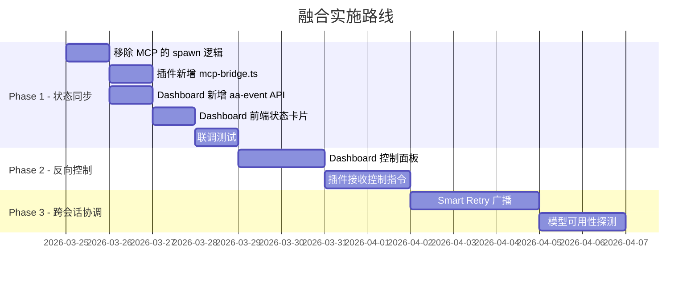

# Antigravity 工作流自动化平台 — 融合需求文档

> **文档版本**: v1.0  |  **日期**: 2026-03-24  |  **状态**: 规划中

---

## 1. 背景与目标

### 1.1 两个项目

| 项目 | 定位 | 核心能力 | 运行方式 |
|------|------|----------|----------|
| **antigravity-local-mcp** | 任务管理 + 工作流编排 | Task Hub（CRUD + DAG）、Planner（周计划 / 日排程）、Context Bridge（跨会话共享）、Dashboard（Web 看板） | MCP Server（独立 Node.js 进程，stdio 通信） |
| **Antigravity-Auto-Accept** | UI 自动化 + 操作确认 | CDP 按钮点击、SDK 信号驱动、Smart Retry（模型切换 + 自动重试） | VS Code 插件 v2.0.0（Extension Host 内，方案C 架构） |

### 1.2 已有交集

Dashboard 模块已通过 `child_process.spawn` 管理 `auto-accept.js` 子进程：

```
MCP Server  ──spawn──→  auto-accept.js (独立进程)
               └── stdout/stderr → SSE 推送到 Dashboard
```

**痛点**：
- 粗粒度进程管理：只能看日志，无法控制策略
- 状态不共享：MCP 不知道 CDP 点击了什么，CDP 不知道任务进度
- 配置分散：MCP 任务数据、Auto-Accept config.json、VS Code Settings 三处互不相通
- 插件版本 v2.0.0（方案C）和 MCP 完全脱节

### 1.3 融合目标

> 让 Dashboard 成为统一的监控面板：**任务进度 + Auto-Accept 状态 + 会话动态** 在一个界面上实时可见、可控。

---

## 2. 功能需求

### FR-1：IDE 内嵌 Dashboard（WebView 方案）

**优先级**: P0（第一期）

**目标**：在 IDE 侧边栏内嵌 Dashboard 面板，用户无需打开浏览器即可实时查看 Auto-Accept 状态和任务进度。

#### 1.1 为什么用 WebView 而非浏览器

| 维度 | 浏览器 localhost:3456 | 插件 WebView |
|------|----------------------|-------------|
| 用户操作 | 手动打开浏览器+输地址 | 点击侧边栏图标 |
| 与 IDE 集成 | 独立窗口，需来回切换 | 直接在 IDE 内，和代码并排 |
| 数据来源 | HTTP 请求 | 直接从插件内存读取（零延迟） |
| 通信方式 | SSE | `webview.postMessage()`（原生） |
| 安全性 | 暴露 HTTP 端口 | 内部通信，无端口暴露 |

#### 1.2 WebView 面板内容

```
┌─ Auto-Accept Dashboard ─────────────────┐
│                                         │
│  🤖 运行状态: 🟢 运行中                  │
│  📡 CDP: 5 个 Target 已连接              │
│                                         │
│  ┌─ 今日统计 ──────────────────────────┐ │
│  │ ✅ 自动点击: 23 次                   │ │
│  │ 🔄 自动重试: 2 次                    │ │
│  │ 📊 成功率: 96%                       │ │
│  └──────────────────────────────────────┘ │
│                                         │
│  ┌─ 最近操作 ──────────────────────────┐ │
│  │ 10:15 ✅ 点击 "Run" (Target: agent) │ │
│  │ 10:12 🔄 Retry → Claude Sonnet OK  │ │
│  │ 10:08 ✅ 点击 "Accept" (session-2)  │ │
│  └──────────────────────────────────────┘ │
│                                         │
│  ┌─ 任务概览（来自 MCP）─────────────┐   │
│  │ 📋 3 todo | 🔄 2 进行中 | ✅ 1 完成 │ │
│  └──────────────────────────────────────┘ │
│                                         │
│  [⏸ 暂停]  [🔄 重启]  [📋 查看日志]     │
└─────────────────────────────────────────┘
```

#### 1.3 数据流

```
CDPTargetManager → 点击事件 → WebViewProvider.postMessage()
                                    ↓
                              WebView HTML (JS)
                                    ↓
                              DOM 更新（实时渲染）

MCP Dashboard API (localhost:3456/api/data)
        ↓ HTTP GET（定时拉取任务数据）
  WebViewProvider → postMessage() → WebView HTML
```

#### 1.4 插件端变更

| 变更 | 说明 |
|------|------|
| **新增** `webview-provider.ts` | WebviewViewProvider，侧边栏面板 |
| **新增** `webview/dashboard.html` | WebView HTML + CSS + JS |
| **新增** `mcp-bridge.ts` | HTTP 客户端，拉取 MCP 任务数据 |
| **修改** `cdp-target-manager.ts` | 点击后通知 WebViewProvider |
| **修改** `cdp-smart-retry.ts` | Retry 后通知 WebViewProvider |
| **修改** `package.json` | 注册 `viewsContainers` + `views` |

---

### FR-2：CDP 执行状态 → Dashboard 统计同步

**优先级**: P0（第一期）

**目标**：Auto-Accept 的点击和重试统计自动汇入 Dashboard，不依赖手动查看 Output 日志。

| CDP 事件 | Dashboard 更新 |
|----------|----------------|
| 点击 "Run" / "Accept" 等 | 今日点击计数 +1，历史记录新增一条 |
| Smart Retry 成功 | 今日重试计数 +1，记录模型切换详情 |
| Smart Retry 失败超限 | 状态卡片显示 ⚠️ 警告 |
| CDP 连接/断开 | 实时更新连接状态和 Target 数 |

---

### FR-3：WebView 内嵌控制面板

**优先级**: P1（第二期）

**目标**：用户直接在 WebView 面板中控制 Auto-Accept 行为。

| 操作 | 实现方式 |
|------|----------|
| 暂停/恢复 | WebView `postMessage` → 插件执行 `autoAcceptor.toggle()` |
| 调整按钮白名单 | WebView 编辑 → 插件调用 `vscode.workspace.getConfiguration().update()` |
| 查看点击历史 | 内存环形缓冲区，通过 `postMessage` 渲染 |

> WebView 方案的优势：**无需反向通信难题**。WebView 和 Extension Host 通过 `postMessage` 双向通信，天然支持控制指令。

---

### FR-4：跨会话 Smart Retry 协调

**优先级**: P2（第三期）

**目标**：当一个会话的 Smart Retry 发现某模型不可用时，通过 Context Bridge 通知其他会话。

```
会话1: Claude Opus → 400 错误 → 切到 Sonnet → Retry 成功
  ↓ 自动通过 Context Bridge 广播
会话2、3: 收到通知 → 预防性切换模型（避免相同错误）
  ↓ 5 分钟后
会话1: 自动探测 Opus 恢复 → 广播恢复 → 所有会话切回
```

---

## 3. 技术架构

### 3.1 通信拓扑

```
┌──────────────────────────────────────────────────────┐
│ Antigravity IDE                                      │
│                                                      │
│  ┌─ Extension Host ──────────────────────────────┐   │
│  │ Auto-Accept 插件 v2.0.0                       │   │
│  │  SDK Monitor ──信号──→ CDPTargetManager.scan() │   │
│  │                            │                   │   │
│  │               点击/重试后   ▼                   │   │
│  │            WebViewProvider.postMessage()        │   │
│  │                            │                   │   │
│  │            MCP Bridge ──HTTP GET──→ :3456      │   │
│  │              (拉取任务数据，可选)                │   │
│  └────────────────────────────────────────────────┘   │
│           ↕ CDP             ↕ postMessage             │
│  ┌────────────────┐  ┌───────────────────────────┐   │
│  │ Agent Panel    │  │ WebView Dashboard         │   │
│  │ Run / Accept   │  │ 状态 + 统计 + 控制 + 任务  │   │
│  └────────────────┘  └───────────────────────────┘   │
└──────────────────────────────────────────────────────┘
          │ HTTP (localhost:3456, 可选)
          ▼
┌──────────────────────────────────────────────────────┐
│ MCP Server (antigravity-local-mcp)                   │
│  Task Hub | Planner | Context Bridge                 │
│  [REMOVE] spawn auto-accept.js                       │
│  [KEEP] /api/data (供插件拉取任务数据)                │
└──────────────────────────────────────────────────────┘
```

### 3.2 通信方式

| 方向 | 方式 | 说明 |
|------|------|------|
| 插件 → WebView | `postMessage` | 推送点击/重试/状态事件（实时） |
| WebView → 插件 | `postMessage` | 用户控制操作（暂停/重启等） |
| 插件 → MCP | HTTP GET | 拉取任务数据（可选，定时） |

---

## 4. 涉及文件变更清单

### 4.1 Auto-Accept 插件 (`extension/`)

| 操作 | 文件 | 说明 |
|------|------|------|
| **NEW** | `src/webview-provider.ts` | WebviewViewProvider，管理侧边栏面板 |
| **NEW** | `webview/dashboard.html` | WebView 面板的 HTML + CSS + JS |
| **NEW** | `src/mcp-bridge.ts` | HTTP 客户端，拉取 MCP 任务数据（可选） |
| **MODIFY** | `src/cdp-target-manager.ts` | 点击后通知 WebViewProvider |
| **MODIFY** | `src/cdp-smart-retry.ts` | Retry 后通知 WebViewProvider |
| **MODIFY** | `src/auto-acceptor.ts` | 初始化 WebViewProvider |
| **MODIFY** | `package.json` | 注册 `viewsContainers` + `views` |

### 4.2 MCP Server (`antigravity-local-mcp/src/`)

| 操作 | 文件 | 说明 |
|------|------|------|
| **MODIFY** | `modules/dashboard.ts` | 移除 `spawn auto-accept.js` 相关代码 |
| **MODIFY** | `src/index.ts` | 移除 `startAutoAccept` / `stopAutoAccept` 调用 |

---

## 5. 实施路线



---

## 6. 风险与缓解

| 风险 | 概率 | 影响 | 缓解 |
|------|------|------|------|
| Dashboard 未启动时插件推送失败 | 高 | 低 | 推送失败静默忽略，不影响核心功能 |
| HTTP 推送延迟影响 CDP 性能 | 低 | 中 | 异步非阻塞推送，不 await |
| Dashboard 端口被占用 | 低 | 中 | 可配置端口 |
| 反向控制的安全性 | 低 | 中 | 仅监听 localhost |

---

## 7. 验收标准

### Phase 1 验收

- [ ] MCP Server 启动后不再自动 spawn auto-accept.js
- [ ] IDE 侧边栏出现 Auto-Accept Dashboard 面板
- [ ] 每次自动点击后 WebView 面板实时更新统计
- [ ] 面板显示 CDP 连接状态和 Target 数
- [ ] 点击面板 [暂停] 按钮可控制 Auto-Accept 开关
